# AiKhbar // اے آئی خبر

> An Urdu AI-powered **news intelligence and audio briefing platform**.


AiKhbar aggregates real-time Urdu news, summarizes it with LLMs, generates
natural Urdu audio briefings, aggregates opinions through RAG, reconstructs
historical context, and lets users explore the news conversationally.

---

## Features

| # | Feature | Description |
|---|---------|-------------|
| 1 | **News Ingestion** | Scheduled RSS scraping of BBC Urdu, Daily Jang, Express, ARY and Hum Sub with full-text extraction, lead-image extraction and deduplication. |
| 2 | **AI Classification** | Zero-shot classification into 7 categories (Politics, Sports, Economy, Crime, International, Technology, Entertainment). |
| 3 | **Multi-Document Summarization** | Clusters articles about the same story and produces one unified Urdu summary at 4 depths. |
| 4 | **Urdu Audio Briefings** | Podcast-style narration via Urdu Orator (Uplift AI) with a Coqui XTTS-v2 fallback. |
| 5 | **RAG Opinion Aggregation** | Retrieves editorials/discussions and clusters viewpoints (public, political, expert, international). |
| 6 | **Media Analysis Engine** | Detects tone, political leaning, sentiment and propaganda indicators. |
| 7 | **Personalization** | Learns time-decayed category affinity from user interactions to rank a personalized feed. |
| 8 | **Conversational News Chat** | RAG-grounded Q&A with conversational memory, over REST or WebSocket. |
| 9 | **Timeline & Context** | Reconstructs a historical timeline of background events for major stories. |
| 10 | **One-Click Daily Brief** | Top stories, summaries, opinions, per-story audio and a 2 to 3 minute Urdu audio brief. |

---

## Architecture

<p align="center">
  
</p>

A clean-architecture separation is enforced: **API routes never contain AI
logic**. They delegate to services in `app/services`, `app/rag`,
`app/summarization`, `app/tts`, `app/classification`, `app/analytics` and
`app/personalization`. See [`docs/ARCHITECTURE.md`](docs/ARCHITECTURE.md).

---

## Tech Stack

**Frontend** — React 18 · Vite 6 · TailwindCSS · Framer Motion · React Router 7
· Redux Toolkit · Axios

**Backend** — Python 3.12 · FastAPI · SQLAlchemy 2 (async) · APScheduler ·
httpx · BeautifulSoup · trafilatura · feedparser

**AI / ML** — NVIDIA NIM (OpenAI-compatible LLM endpoint) · SentenceTransformers
(`multilingual-e5-base`) · FAISS · scikit-learn (clustering)

**Data** — PostgreSQL 16 · Redis (optional cache) · FAISS vector index

**TTS** — Urdu Orator API by Uplift AI (primary) · Coqui XTTS-v2 (open-source fallback)

---

## Project Structure

```
AiKhbar/
├── backend/
│   ├── app/
│   │   ├── api/v1/          # Routers + endpoint modules (HTTP layer only)
│   │   ├── core/            # Config, logging, constants, exceptions
│   │   ├── db/              # Async engine, session, declarative base
│   │   ├── models/          # SQLAlchemy ORM models
│   │   ├── schemas/         # Pydantic request/response schemas
│   │   ├── scraping/        # RSS scraper, extractor, dedup
│   │   ├── classification/  # Zero-shot news classifier
│   │   ├── summarization/   # Story clustering + multi-doc summarizer
│   │   ├── rag/             # FAISS store, indexer, retriever, opinion/timeline
│   │   ├── tts/             # Provider abstraction + Urdu Orator/Coqui + narration
│   │   ├── analytics/       # Media analysis engine
│   │   ├── personalization/ # Affinity learning + personalized feed
│   │   ├── services/        # Repositories + orchestration (pipeline, daily brief)
│   │   ├── websocket/       # Live chat & feed sockets
│   │   └── main.py          # FastAPI app factory + lifespan
│   ├── migrations/          # Alembic migrations
│   ├── tests/               # Pytest suite
│   ├── requirements/        # base / dev / prod requirement files
│   └── Dockerfile
├── frontend/
│   └── src/
│       ├── components/      # Reusable animated components
│       ├── pages/           # Route pages
│       ├── layouts/         # Page shell
│       ├── store/           # Redux Toolkit store + slices
│       ├── services/        # API client
│       ├── hooks/           # WebSocket hook
│       └── lib/             # Utilities
├── docs/                    # Architecture, API, roadmap, diagrams
├── report/                  # LaTeX academic report
├── docker-compose.yml
└── .env.example
```

---

## Quick Start

### Prerequisites
- Python 3.11+ · Node.js 20+ · PostgreSQL 16
- A free [NVIDIA NIM API key](https://build.nvidia.com)

### 1. Clone & configure
```bash
git clone https://github.com/omerrfarooqq/AiKhbar.git
cd AiKhbar
cp .env.example .env          # then fill in NVIDIA_API_KEY etc.
```

### 2. Backend
```bash
cd backend
python -m venv .venv
.venv\Scripts\activate         
pip install -r requirements/dev.txt

# Run the API (auto-creates tables in dev mode)
uvicorn app.main:app --reload
```
API docs: <http://localhost:8000/docs>

### 3. Frontend
```bash
cd frontend
npm install
npm run dev
```
App: <http://localhost:5173>

### 4. Run an ingestion cycle manually
```bash
cd backend
python -m scripts.run_ingestion
```

### Or — everything with Docker
```bash
docker compose up --build
```

See [`docs/SETUP.md`](docs/SETUP.md) for the full guide and
[`docs/DEPLOYMENT.md`](docs/DEPLOYMENT.md) for production deployment.

---

## Key API Endpoints

| Method | Path | Purpose |
|--------|------|---------|
| `GET`  | `/api/v1/news` | List / filter news (category, source, date) |
| `GET`  | `/api/v1/news/categories` | Categories with counts |
| `POST` | `/api/v1/news/scrape` | Trigger an ingestion run |
| `GET`  | `/api/v1/stories/top` | Top story clusters |
| `POST` | `/api/v1/stories/{id}/summary` | Generate a unified summary |
| `POST` | `/api/v1/stories/{id}/opinions` | RAG opinion aggregation |
| `POST` | `/api/v1/stories/{id}/timeline` | Build a historical timeline |
| `POST` | `/api/v1/briefs/daily` | One-click daily brief |
| `POST` | `/api/v1/briefs/audio-digest` | 2 to 3 minute Urdu audio brief |
| `POST` | `/api/v1/chat` | Conversational news Q&A |
| `POST` | `/api/v1/tts/synthesize` | Urdu text-to-speech |
| `WS`   | `/ws/chat` | Live conversational chat |

Full reference: [`docs/API.md`](docs/API.md).

---

## Testing
```bash
cd backend
pytest                  
ruff check .            
```

---

## Roadmap

See [`docs/ROADMAP.md`](docs/ROADMAP.md). Highlights:
- Celery + Redis for distributed task processing at scale
- Streaming LLM responses over WebSocket
- Fine-tuned Urdu classifier to replace the zero-shot LLM call
- User auth (JWT) and a saved-topics dashboard
- IVF/HNSW FAISS index for large corpora

---

## License

Released for academic and educational use. Not for commercial use without permission. See [`LICENSE`](LICENSE).


## Author

`Omer Farooq Khan` 
- LinkedIn: <https://www.linkedin.com/in/omerrfarooqq/>
