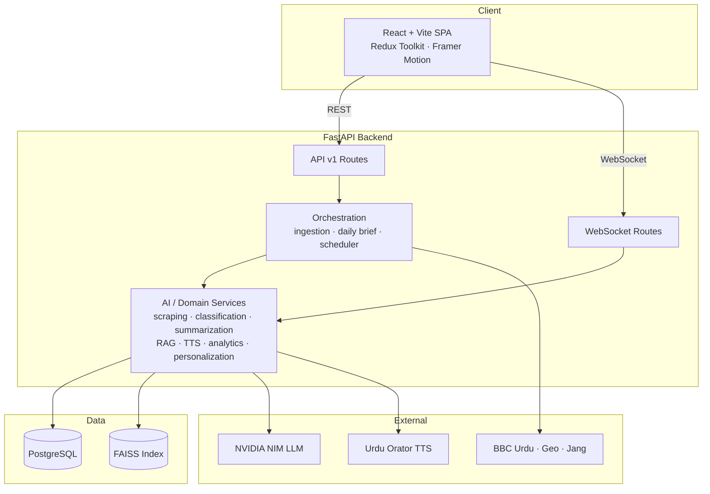
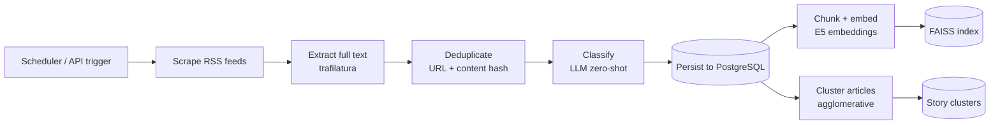
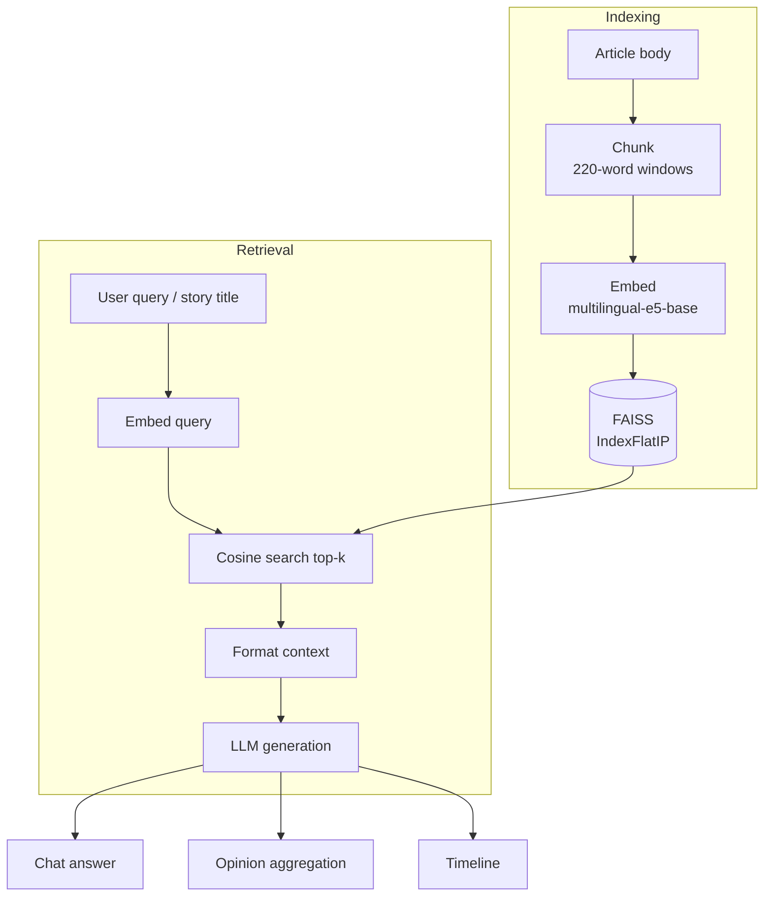
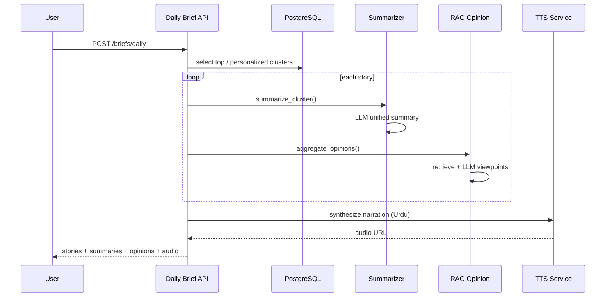
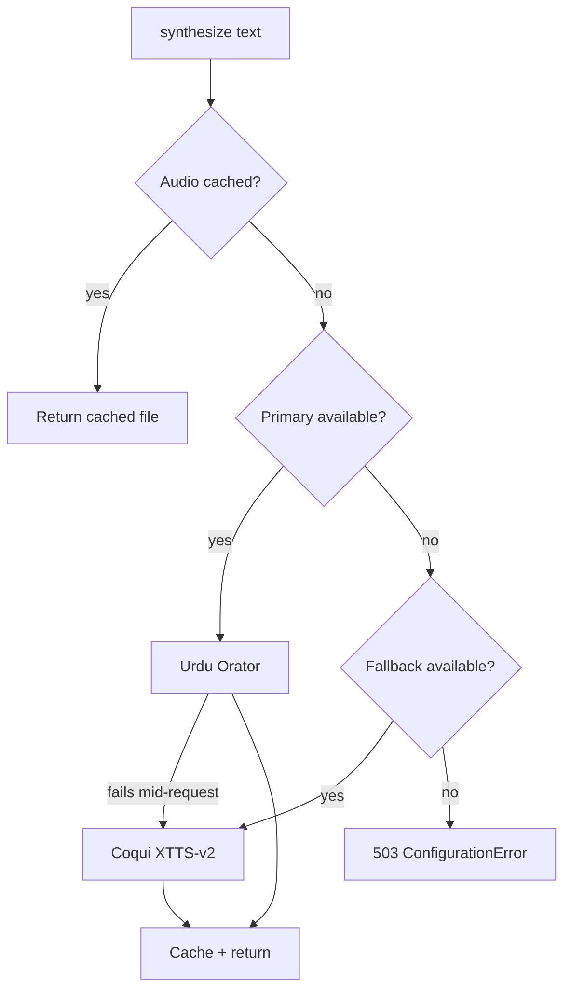

# AiKhbar — System Architecture Diagrams

Diagrams use [Mermaid](https://mermaid.js.org) — they render on GitHub and in
most Markdown viewers.

## 1. High-Level System

## 2. News Ingestion Pipeline

## 3. RAG Pipeline

## 4. One-Click Daily Brief

## 5. TTS Provider Selection

